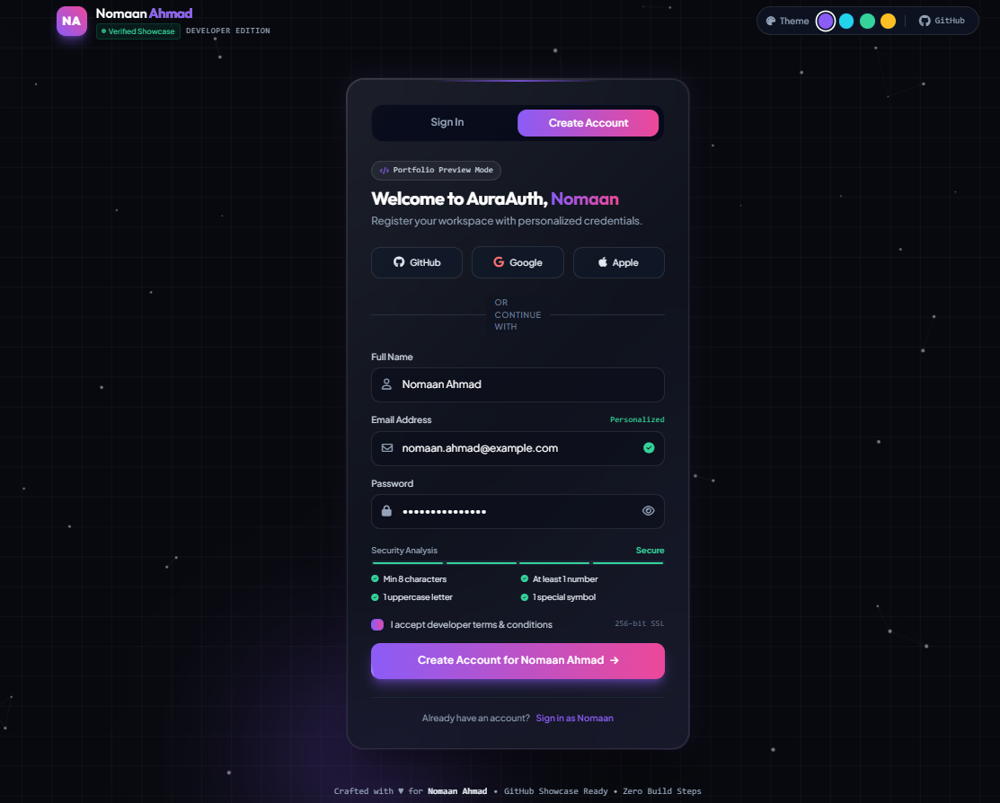
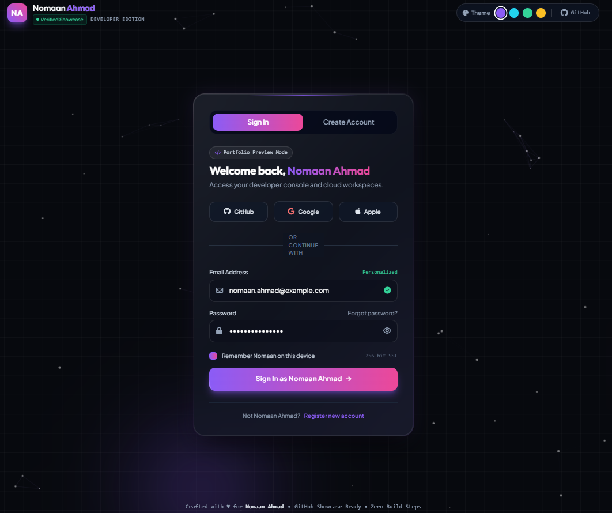

<div align="center">

# 🌌 Glassmorphism Auth UI

### Ultra-Modern Aurora Glow Authentication Showcase

A sleek, responsive authentication experience built with vanilla HTML, modern CSS glassmorphism, dynamic particle physics, and real-time form validation.

[](LICENSE)
[](https://github.com/nomiyehh/glassmorphism-auth-ui)
[](https://github.com/nomiyehh/glassmorphism-auth-ui)
[](https://nomiyehh.github.io/glassmorphism-auth-ui/)

---

### 📸 Visual Previews

<p align="center">
  
</p>

<p align="center">
  
</p>

</div>

---

## ✨ Key Features

- **Trending Glassmorphism & Aurora Glow:** Frosted-glass card aesthetics using `backdrop-filter: blur(28px)`, floating glowing orbs, and gradient borders.
- **Dynamic Particle Canvas:** Interactive particle web with mouse-distance physics and responsive canvas rendering.
- **Dual-Mode Authentication:** Smooth toggle between **Sign In** and **Sign Up** modes with animated sliding indicators.
- **Live Password Strength Meter:** Real-time visual feedback checking length, uppercase letters, digits, and special characters.
- **Theme Palette Switcher:** Live accent color swapping (*Neon Violet*, *Cyber Cyan*, *Emerald Glow*, *Sunset Amber*).
- **Zero Dependencies / No Build Step:** Pure HTML5, CSS3, and JavaScript — works instantly on any static host or GitHub Pages.

---

## 🚀 Quick Start

###  Clone the Repository

```bash
gh repo clone nomiyehh/glassmorphism-auth-ui
